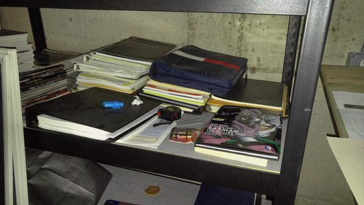

Pelican Static Site Generation
==============================

Hi! Thanks for coming out.  You're great.  You really are.

----

About Me
========

Computer Scientist within Human Factors R&D in FAA

Note: Not an affiliated presentation

Educational background in Mathematics

----

:data-rotate: r90
:data-x: r1000
:data-y: r3000

About Me
========

* Computer (Mad?) Scientist

----

:data-rotate: r-90
:data-x: r1000

History and Motivation
======================

* Collect notes and thoughts (profile?)
* Literate programming
* Real World Haskell - inline code samples and results
* Sage Math platform - replace $$$ systems

----

:data-rotate: r0
:data-x: r2000
:data-y: r0

Collection of Notes
===================

----

Literate Programming
====================

.. html::
    

    <iframe src="http://www.pbrt.org/" title="iframe example 1" width="900" height="700"></iframe>
    

----

Real World Haskell
==================

.. html::
    

    <iframe src="http://book.realworldhaskell.org/read/functional-programming.html" title="iframe example 1" width="900" height="700"></iframe>
    

----

.. image:: https://www.sagemath.org/pix/sage_logo_new_l_hc_edgy-nq8.png

SageMath is a free open-source mathematics software system licensed under the GPL. 

*Mission*: Creating a viable free open source alternative to Magma, Maple, Mathematica and Matlab.

----

.. image:: https://www.sagemath.org/pix/sage_logo_new_l_hc_edgy-nq8.png

SageMath is a free open-source mathematics software system licensed under the GPL. 
It builds on top of many existing open-source packages: 

- NumPy, SciPy, matplotlib
- Sympy, Maxima
- GAP
- FLINT
- R and many more. 
  
Access their combined power through a common, Python-based language or directly via interfaces or wrappers.

----

.. image:: https://sagecell.sagemath.org/static/sagemathcell-logo.png?v=cee2c58e80f2ffd0968d7a8266fac283

SageMathCell project is an easy-to-use web interface to a free open-source mathematics software system SageMath.

It allows embedding Sage computations into any webpage.

----

:data-rotate: r-90

2D Graphics - Random Data
=========================

.. sage-image:: random matrix eigenvalues
    :file: /pages/sage/overview.rst

----

2D Graphics - Region Plots
==========================

.. sage-image:: region plots
    :file: /pages/sage/overview.rst

----

2D Graphics - Density Plots
===========================

.. sage-image:: density plots
    :file: /pages/sage/overview.rst

----

Differential Equations
======================

.. sage-image:: euler method diffq
    :file: /pages/sage/overview.rst

----

Graph Theory
============

.. sage-image:: graph1
    :file: /pages/sage/overview.rst

----

Graph Theory
============

.. sage-image:: graph2
    :file: /pages/sage/overview.rst

----

Graph Theory
============

.. sage-image:: graph3
    :file: /pages/sage/overview.rst

----

Graph Theory
============

.. sage-image:: graph3 _ removing verts
    :file: /pages/sage/overview.rst

----

:data-rotate: r0
:data-x: r2000

Static Site Generation?
=======================

A static site generator (SSG) is a compromise between using a hand-coded static site and a full CMS. You generate an HTML-only website using raw data (such as Markdown files) and templates. The resulting build is transferred to your live server.

(https://www.sitepoint.com/7-reasons-not-use-static-site-generator/)

----

Alternatives
============

.. html::
    

    <iframe src="https://www.staticgen.com/" title="iframe example 1" width="900" height="700"></iframe>
    

----

Static Site Generation - Benefits
=================================

- Speed (no complicated caching)
- Version control
- Security
- Less Hassel with a server
- Traffic surges

----

Static Site Generation - Disadvantages
======================================

- No real-time content
- No user input
- Time to set up vs CMS systems

----

Static Site Generation - Mitigation
===================================

- Make it feel real-time
- Select and specific services

----

Pelican Static Site Generator
-----------------------------

Write your content in reStructuredText, Markdown, or AsciiDoc formats

Themes that can be customized via Jinja templates

Code syntax highlighting

Modular plugin system and corresponding plugin repository
- (Written in python!)

----

Pelican Static Site Generator
=============================

.. html::
    

    <iframe src="https://blog.getpelican.com/" title="iframe example 1" width="900" height="700"></iframe>
    

----

Pelican Static Site Generator
=============================

Installation

.. code::

    $ pip install pelican markdown
    $ mkdir -p ~/projects/yoursite
    $ cd ~/projects/yoursite
    $ pelican-quickstart

----

Pelican Static Site Generator
=============================

Write an article
----------------

.. code::

    Title: My First Review
    Date: 2018-05-31
    Category: Review

    Following is a review of my favorite thing in the whole world.

Save it as:
-----------

.. code::

    ~/projects/yoursite/content/my-review.md

----

Pelican Static Site Generator
=============================

Generate your site!
-------------------

.. code::

    $ pelican content

Preview the content:
--------------------

.. code::

    $ cd ~/projects/yoursite/output
    $ python -m pelican.server

----

Themes and Plugins
==================

`Pelican Themes`_

`Pelican Plugins`_

.. _Pelican Themes: https://github.com/getpelican/pelican-themes
.. _Pelican Plugins: https://github.com/getpelican/pelican-plugins

----

Themes
======

.. html::
    

    <iframe src="http://kenmercuslai.github.io/blog/index.html" title="iframe example 1" width="900" height="700"></iframe>
    

----

Customizing Themes
==================

.. html::
    

    <iframe src="https://www.nelsonbrown.net/" title="iframe example 1" width="900" height="700"></iframe>
    

----

Pelican Static Site Generator
=============================

My project directory

.. code::

    /home/nelson/projects/pelican
    ├── hovercraft
    ├── nelsonbrown.net
    │   ├── nelsonbrown.net
    │   │   ├── content
    │   │   │   ├── db
    │   │   │   ├── pages
    │   │   │   │   ├── fp_in_scala
    │   │   │   │   ├── notebooks
    │   │   │   │   │   ├── fp_in_scala
    │   │   │   │   │   └── haskellbook
    │   │   │   │   └── sage
    │   │   │   └── slides
    │   │   ├── output
    │   └── nelsonbrown.net-theme
    ├── pelican-plugins
    ├── pelican-sage

----

Pelican Static Site Generator
=============================

Contents of the configuration directory 

(/pelican/nelsonbrown.net/nelsonbrown.net/)

.. code::

    content
    deploy.sh
    fabfile.py
    Makefile
    output
    pelicanconf.py
    publishconf.py

----

Installing Plugins
==================

Just point to the plugin path in the configuration settings, and choose which ones you want.

.. code::

    PLUGIN_PATHS = [os.path.abspath(os.path.join(base_plugin_path,p)) 
        for p in ('pelican-plugins/','pelican-sage/')]

    PLUGINS = ['pelicansage',
               'render_math',
               'pelican-ipynb.markup',
               'html_rst_directive'] 

Alternatively,

.. code::

    from package import myplugin
    PLUGINS = [myplugin,]

----

Jupyter Notebook Conversion
===========================

.. html::
    

    <iframe src="https://www.nelsonbrown.net/pages/notebook-test-2.html" title="iframe example 1" width="900" height="700"></iframe>
    

----

Fetching Sage Cell Results
===========================

.. html::
    

    <iframe src="https://www.nelsonbrown.net/pelicansage.html" title="iframe example 1" width="900" height="700"></iframe>
    

----

Fetching Sage Cell Results
===========================

.. code::

    .. sage::
        :id: interesting graphic

        import numpy

        difference = 3

        print "This gets sent to stdout, returned as a stream result."
        
        import pylab as plt
        
        t = plt.arange(0.0, 2.0, 0.01)
        s = plt.sin(2*pi*t)
        plt.plot(t, s)
        plt.xlabel('time (s)')
        plt.ylabel('voltage (mV)')
        plt.title('About as simple as it gets, folks')
        plt.grid(True)
        plt.show()

----

Combining the Two Ideas
=======================

We can use PelicanSage to convert these individual blocks into content, using the ipynb directive specifying the zero-indexed order of the cell we want.

.. code:: ReST

    .. ipynb:: /pages/notebooks/notebook_haskell_sample_nb3format.ipynb
        :cell-order: 3

----

Combining the Two Ideas
=======================

We can take a code from a Jupyter notebook sample

.. ipynb:: /pages/notebooks/notebook_haskell_sample_nb3format.ipynb
    :cell-order: 3
    :suppress-results:

----

My Own Plugin Workflow
======================

We can take a code from a Jupyter notebook sample

.. ipynb:: /pages/notebooks/notebook_haskell_sample_nb3format.ipynb
    :cell-order: 3
    :suppress-code:

----

Creating Your Own Plugins
=========================

What about your own plugin?

How about something to make presentations?

----

Plugin Registration
===================

.. code::

    from pelican import signals

    def test(sender):
        print "%s initialized !!" % sender

    def register():
        signals.initialized.connect(test)

----

Pelican Internals
=================

.. html::
    

    <iframe src="http://docs.getpelican.com/en/stable/internals.html" title="iframe example 1" width="900" height="700"></iframe>
    

----

Creating Your Own Plugins
=========================

Connecting the idea of sage with generated static sites.

.. code::

    def add_generator(pelican_object):
        return SlidesGenerator

    def register():

        directives.register_directive('sage', SageDirective)
        directives.register_directive('sage-image', SageImage)
        directives.register_directive('sage-result', SageResult)
        directives.register_directive('ipynb', IPythonNotebook)

        signals.article_generator_preread.connect(pre_read)
        signals.article_generator_context.connect(post_context)
        signals.initialized.connect(sage_init)
        signals.get_generators.connect(add_generator)

----

Presentations - HoverCraft
==========================

Connecting other tools in the python ecosystem - Hovercraft

.. html::
    

    <iframe src="http://regebro.github.io/hovercraft/" title="iframe example 1" width="900" height="700"></iframe>
    

----

Creating Your Own Plugins
=========================

Connecting other tools in the python

.. code::

    class SlidesGenerator(CachingGenerator):
        """Generates Hovercraft Slides"""

        def __init__(self, *args, **kwargs):
            self.slides = []
            self.hidden_slides = []
            super(SlidesGenerator, self).__init__(*args, **kwargs)

        def generate_context(self):
            pass

        def generate_output(self, writer):
            (...)

----

Creating Your Own Plugins
=========================

Connecting other tools in the python

.. code::

    template_path = os.path.abspath(self.settings['SLIDES_THEME'])
    output_path = os.path.abspath(os.path.join(self.output_path, 'slides'))
    [...]

    for f in self.get_files(
            self.settings['SLIDE_PATHS'],
            exclude=self.settings['SLIDE_EXCLUDES']):

        presentation = os.path.abspath(os.path.join('content', f))
        args = Namespace(presentation=presentation,
                         template=template_path,
                         targetdir=output_path,
                         css=None,
                         js=None,
                         auto_console=False,
                         (...)

        try:
            generate(args)
        except Exception as e:
            logger.error(
                'Could not process %s\n%s', f, e)
            self._add_failed_source_path(f)

----

The result?
===========

.. code::

    ----

    :data-rotate: r-90

    2D Graphics - Random Data
    =========================

    .. sage-image:: random matrix eigenvalues
        :file: /pages/sage/overview.rst

    ----

    :data-rotate: r180
    :data-x: r-1000
    :data-scale: 3

    Questions? Discussions?
    =======================

    Thanks!!!! :)

----

:data-rotate: r-90

2D Graphics - Random Data
=========================

.. sage-image:: random matrix eigenvalues
    :file: /pages/sage/overview.rst

----

:data-rotate: r180
:data-x: r-1000
:data-scale: 3

Questions?
==========

Thanks!!!! :)

