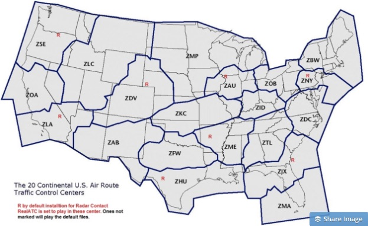
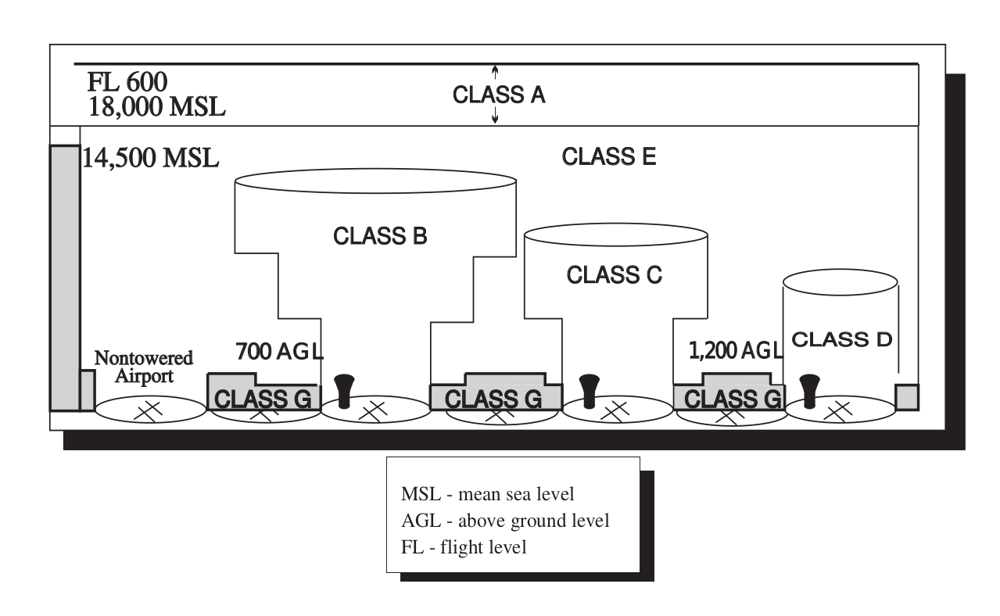
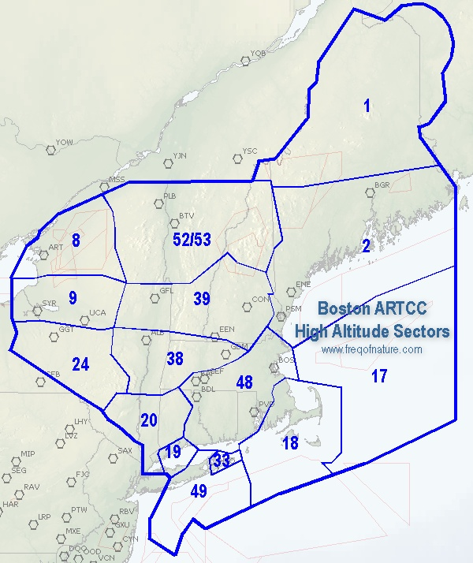

GeoSpark for Aviation Data
===========================

Hi! Thanks for coming out.  You're great.  You really are.

----

Background
==========

----

Background
==========

----

Background
==========

----

Pre-req Setup
=============

* Some background with Spark and Docker
* Intellij Editor, PyCharm
* Git
* Scala + SBT
* Python (2.7 yuck)
* Starting a local Spark node

----

Starting a local Spark node
===========================

.. code:: scala

   def getSparkSession(runLocal: Boolean, appName: String): SparkSession = {
    val sparkBuilder = SparkSession.builder()
    val sparkBuilderMaster = if (runLocal) {
      sparkBuilder.master("local[*]").appName(appName).config("geospark.join.numpartition", "1")
    } else {
      sparkBuilder.appName(appName)
    }
    val sparkSession = sparkBuilderMaster.
      config("spark.serializer",classOf[KryoSerializer].getName).
      config("spark.kryo.registrator", classOf[GeoSparkKryoRegistrator].getName).
      config("geospark.global.index", "true").
      getOrCreate()
    GeoSparkSQLRegistrator.registerAll(sparkSession.sqlContext)
    sparkSession
  }

----

High Level
==========

1. Read threaded track data in it's native format.
2. Convert the time/lat/lon/altitude into GeoSpark objects.
3. Read in the airspace volumes, convert to GeoSpark objects.
4. Calculate the overlap between points and volumes.
5. Remove the exclusions.
6. Group by the threaded track id, time, and add an index
7. Find the first and last occupied airspace volume by track id.
8. Find where each threaded track id "traverses" volumes.
9. Union steps 7 and 8 together, do some cleanup.

----

Read threaded track data in it's native format.
===============================================

*STEP ONE*

We read in the threaded track data in it's native Avro format.

We extract out those bits of information that we are interested in
(threaded track id, lat/lon, pressure altitude, and time)

.. code:: scala

    val ttDF = getThreadedTrackDF(runAll, sparkSession, ttFilePath)

----

Read threaded track data in it's native format.
===============================================

.. code:: scala

  def getThreadedTrackDF (runAll: Boolean, 
                          sparkSession: SparkSession,
                          ttFilePath: String): DataFrame  = {
    val tt_df: DataFrame = (if(runAll) {
      sparkSession.read.avro(ttFilePath)
    } else {
      sparkSession.read.avro(ttFilePath)
        .filter(col("tt_id").isin(
          "2017030100001328_2.3.0-F",
          "2017030101686679_2.3.0-F",
          "2017030101686656_2.3.0-F"
        ))
    }).select("tt_id", "threaded_track")
      .withColumn("threaded_track", explode(col("threaded_track")))
      .select("tt_id", "threaded_track.*")
      .select("tt_id", "time", "latitude", "longitude", "pressure_altitude")
    tt_df
  }

----

Read threaded track data in it's native format.
===============================================

*STEP ONE* (continued)

If we're just doing some sample / test processing, we can extract
a subset of this data and save it to a CSV file for examination.

.. code:: scala

    val ttDF = getCsvTTDF(sparkSession,
      Paths.get("src", "test", "resources", "sample_tracks.csv").toAbsolutePath.toString)

----

Read threaded track data in it's native format.
===============================================

.. code:: scala

  def getCsvTTDF(sparkSession: SparkSession, csvFilePath: String): DataFrame = {
    sparkSession
        .read
        .format("csv")
        .option("header", value = true)
        .load(csvFilePath)
  }

----

Convert the time/lat/lon/altitude into GeoSpark objects.
========================================================

*STEP TWO*

The data that we've extracted from the AVRO threaded track is not yet
in a format that we can use GeoSpark's underlying spatial operations
with, we need to use the basic datatypes of strings and numbers and
create object provided by the framework for processing.

.. code:: scala

    val pointDF = getPointDF(sparkSession, ttDF)

----

Convert the time/lat/lon/altitude into GeoSpark objects.
========================================================

*STEP TWO*

.. code:: scala

  def getPointDF(sparkSession: SparkSession, tt_df : DataFrame) : DataFrame = {
      tt_df.createOrReplaceTempView("tt_df")
      var pointDF = sparkSession.sql(
      "select " + 
      "ST_Point(cast(tt_df.longitude as Decimal(24,20)), "+ 
               "cast(tt_df.latitude as Decimal(24,20))) AS lonlat_point," +
      "tt_id, time, latitude, longitude, pressure_altitude" +
      " FROM tt_df")
      pointDF = pointDF.withColumn("timestamp", from_unixtime(col("time") / 1000.0))
      pointDF.createOrReplaceTempView("pointDF")
      pointDF
  }

----

A NOTE ON PARTITIONING
======================

**NOTE**: Repartitioning large datasets is an important step.
Too few partitions, and you will not take advantage of
your cluster, and too many and you'll spend too much time
communicating the information between executors (a process
called shuffling) and not enough time performing computation.

*STEP TWO*

.. code:: scala

    pointDF.repartition(200)

----

Read in the airspace volumes, convert to GeoSpark objects.
==========================================================

*STEP THREE*

Now that we have points, we need the fixed airspace volumes to which
we want to find the points within those volumes (let's call that
"overlap").

Here, we do the same process of converting basic datatypes into
datatypes that can be processed.

.. code:: scala

    val favDF = convertFavToGeoJson(sparkSession, loadFavDF(sparkSession, GEO_JSON_FAV_PATH))

----

Read in the airspace volumes, convert to GeoSpark objects.
==========================================================

*STEP THREE*

Now that we have points, we need the fixed airspace volumes to which
we want to find the points within those volumes (let's call that
"overlap").

Here, we do the same process of converting basic datatypes into
datatypes that can be processed.

.. code:: scala

    val favDF = convertFavToGeoJson(sparkSession, loadFavDF(sparkSession, GEO_JSON_FAV_PATH))

----

Read in the airspace volumes, convert to GeoSpark objects.
==========================================================

*STEP THREE*

.. code:: scala

  def convertFavToGeoJson(sparkSession: SparkSession, 
                          loadedDF: DataFrame) : DataFrame = {
      loadedDF.createOrReplaceTempView("fav_geojs")
      var favGeoJsDF = sparkSession.sql(
      "select Facility, FavID, cast(fav_geojs.AltLow as Integer) as min_alt," +
      "cast(fav_geojs.AltHigh as Integer) as max_alt, GeoJSON, Inclusion FROM fav_geojs " +
      "WHERE fav_geojs.Facility='ZAB'")

      //account for 100ft gap in FAV module altitude bounds
      favGeoJsDF = favGeoJsDF.withColumn("max_alt", col("max_alt") + 100) 
        .withColumn("FavID", concat(col("Facility"), col("FavID")))

      favGeoJsDF.createOrReplaceTempView("fav_geojs")
      val favDF = sparkSession.sql(
      "select FavID, min_alt, max_alt, Inclusion," + 
      " ST_GeomFromGeoJSON(fav_geojs.GeoJSON) AS polygon FROM fav_geojs")
      favDF.createOrReplaceTempView("favDF")
      favDF
  }

----

Calculate the overlap between points and volumes.
=================================================

*STEP FOUR*

In this step, we calculate where the overlap exists between points and
the fixed airspace volumes they are within.

.. code:: scala

    val overlapDF = calculateOverlap(sparkSession)

----

Calculate the overlap between points and volumes.
=================================================

*STEP FOUR*

.. code:: scala

  def calculateOverlap(sparkSession: SparkSession): DataFrame = {
    filterColumns(sparkSession.sql(
      "select * FROM pointDF, favDF WHERE " +
      "(pointDF.pressure_altitude >= favDF.min_alt) " +
      "AND (pointDF.pressure_altitude < favDF.max_alt) " +
      "AND ST_Within(pointDF.lonlat_point, favDF.polygon)"),
      Seq(
        "tt_id",
        "time",
        "timestamp",
        "latitude",
        "longitude",
        "pressure_altitude",
        "min_alt",
        "max_alt",
        "FavID",
        "Inclusion"))
  }

----

Remove the exclusions.
======================
*STEP FIVE*

Some airspace volumes are "inclusion", which means they are additive.

Some airspace volumes also define "exclusions".  These are subtractive.

The typical example is a terminal airspace volume "embedded" in an ARTCC
controlled airspace (or some portion thereof).

.. code:: scala

    val overlapInclusionDF = filterInclusionExclusionOverlap(overlapDF)

----

Remove the exclusions.
======================

.. code:: scala

  def filterInclusionExclusionOverlap(overlapDF: DataFrame) : DataFrame = {
    val favWindow = Window.partitionBy("tt_id", "time", "FavID")
    overlapDF.withColumn("count", count("tt_id")
      .over(favWindow))
      .filter(col("count") === 1)
      .drop(col("count"))
      .orderBy(col("tt_id"), col("time"))
  }

----

Group by the threaded track id, time, and add an index
======================================================

*STEP SIX*

We want to find the "transition" points, where the target (represented by
a threaded track id) exits one Fixed Airspace Volume and enters another.

In order to find these transition points, we use a trick by which we
add an index to each row of our dataframe.  This adds the index to the
classified position hits of each target (the overlap).

.. code:: scala

    val overlapIndexed = dfZipWithIndex(overlapInclusionDF, colName = "tt_id_msgid")

----

Find the first and last occupied airspace volume by track id.
=============================================================

*STEP SEVEN*

While finding transition points permits us to find when the target traverses from
one airspace volume to the next, it unfortunately doesn't allow us to find where
the target stops and ends.  This is as there is no "previous" row for the first hit,
and no "next" row for the last hit.

What is needed to to calculate the minimum and maximum indexed value for each target
and include them as a separate dataframe to be combined with our transitions.

.. code:: scala

    val minMaxValues = getMinMaxPointsFromOverlapIndex(sparkSession, overlapIndexed)

----

Find the first and last occupied airspace volume by track id.
=============================================================

.. code:: scala

  def getMinMaxPointsFromOverlapIndex(sparkSession: SparkSession, 
                                      overlapIndexed: DataFrame):
                                      DataFrame = {
      overlapIndexed.createOrReplaceTempView("overlapIndexed")
      sparkSession.sql(
      "SELECT tt.* FROM overlapIndexed tt " +
      "INNER JOIN " + 
      " ( SELECT tt_id, " + 
      "   min(tt_id_msgid) as min_msgid," + 
      "   max(tt_id_msgid) as max_msgid " +
      "FROM overlapIndexed GROUP BY tt_id) tt_min_max " +
      "ON (tt.tt_id_msgid = tt_min_max.min_msgid and" +
      "    tt.tt_id = tt_min_max.tt_id) OR " +
      "   (tt.tt_id_msgid = tt_min_max.max_msgid and " + 
      "    tt.tt_id = tt_min_max.tt_id)")
  }

----

Find where each threaded track id "traverses" volumes.
======================================================

*STEP EIGHT*

To find the transition points, we use a windowing technique to combine one row
of a dataframe with it's subsequent row, and this permits us to perform a row-by-row
comparison without losing the ability to process these rows in parallel.

.. code:: scala

    val transitions = getTransitions(overlapIndexed)

----

Windowing Technique
===================

.. code:: scala

  def leadOneOver(win_func: WindowSpec)
                 (name: String, alias_postfix : String): Column = {
    lead(name,1,null).over(win_func).alias(name + alias_postfix)
  }

----

Find where each threaded track id "traverses" volumes.
======================================================

.. code:: scala

  def getTransitions(overlapIndexed : DataFrame): DataFrame = {
    import overlapIndexed.sqlContext.implicits._
    val win_func : WindowSpec = 
        Window.partitionBy("tt_id").orderBy("tt_id_msgid")

    def leadOne: (String, String) => Column = leadOneOver(win_func)(_, _)

    val transitions = overlapIndexed.select(
      col("tt_id_msgid"),
      leadOne("tt_id_msgid", "_1"),
      col("tt_id"),
      leadOne("tt_id", "_1"),
      col("time"),
      leadOne("time", "_1"),
      col("timestamp"),
      leadOne("timestamp", "_1"),
      col("FavID"),
      leadOne("FavID", "_1")
    ).filter($"tt_id" === $"tt_id_1" and $"FavID" =!= $"FavID_1")
      .withColumn("delta", subWithNulls("time_1", "time"))

    transitions

  }

----

Union steps 7 and 8 together, do some cleanup.
==============================================

*STEP NINE*

The final step is to union the dataframe of transitions with the first and last points
of each target in the threaded track.

.. code:: scala

    val unionMinMaxTransitions = getUnionMinMaxAndTransitions(minMaxValues, transitions)

----

Union steps 7 and 8 together, do some cleanup.
==============================================

.. code:: scala

  def getUnionMinMaxAndTransitions(minMaxValues: DataFrame,
                                   transitions: DataFrame): DataFrame = {
    import transitions.sqlContext.implicits._
    val win_func : WindowSpec =
      Window.partitionBy("tt_id").orderBy("tt_id_msgid")

    def leadOne: (String, String) => Column = leadOneOver(win_func)(_, _)

    val unionMinMaxTransitions =
      unionTwoDataframes(minMaxValues, transitions).select(
        col("tt_id_msgid"),
        leadOne("tt_id_msgid", "_1"),
        leadOne("tt_id_msgid_1", "_2"),
        col("tt_id"),
        leadOne("tt_id", "_1"),
        leadOne("tt_id_1", "_2"),
        col("time"),
        leadOne("time", "_1"),
        leadOne("time_1", "_2"),
        col("timestamp"),
        leadOne("timestamp", "_1"),
        col("FavID"),
        leadOne("FavID", "_1"),
        leadOne("FavID_1", "_2")
      ).filter(not ($"FavID_1".isNull and $"FavID_1_2".isNull))
        .select(
          col("tt_id"),
          col("FavID_1").alias("FavID"),
          col("timestamp").alias("entering"),
          col("timestamp_1").alias("leaving")
        )

    unionMinMaxTransitions

  }

----

Q&A
===

Thanks!
